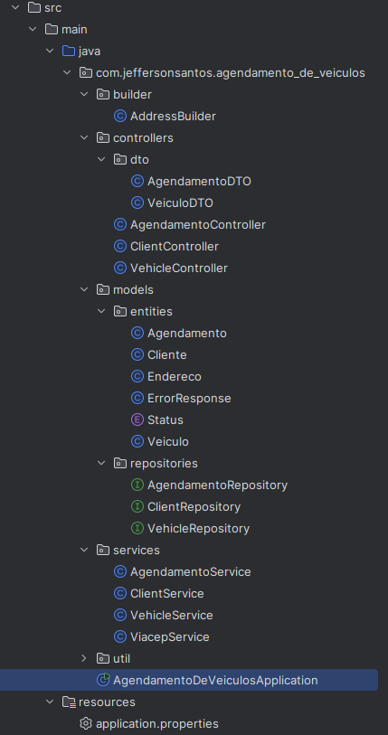

# Agendamento de Veículos

Essa aplicação foi desenvolvida para um teste técnico da empresa [Ultracar](https://www.ultracar.com.br/).

## Navigation Menu

- [Developer](#developer)
- [Project Context](#project-context)
- [Project Structure](#project-structure)
- [Tests](#tests)
- [How to Run](#how-to-run)
  - [With Docker](#with-docker)
  - [Running Locally](#running-locally)
- [Connect with Me](#connect-with-me)

## Developer

- Developed by: [ojeff-dev](https://www.linkedin.com/in/ojefferson/) 💻

## Project Context

Sua tarefa será criar um microsserviço simples para gerenciar o agendamento de manutenções em veículos. Você deverá
implementar três classes: Cliente, Veiculo, e Agendamento, de forma que o agendamento de um serviço esteja vinculado ao
cliente, e o cliente poderá ter um ou mais veículos cadastrados, utilizando Spring Boot e PostgreSQL.

## Project Structure

<details>
  <summary>The project structure is organized as follows:</summary>
  
  
  
</details>

## Tests

In development...

## How to Run

Follow the steps below to run the project locally using Docker or Node.js.

### With Docker:

1. Make sure you have [Docker](https://www.docker.com/) installed:

2. Clone the repository and navigate to the project folder:
   ```bash
   git clone https://github.com/ojeff-dev/agendamento-de-veiculos.git
   cd agendamento-de-veiculos

3. Build and Start container:
   ```bash
   docker-compose up --build

4. Stop the containers
   ```bash
   docker-compose down

- Note:
  ```bash
  The backend will be available at http://localhost:8080
  PostgreSQL will be accessible at localhost:5432
  The application includes Swagger for API documentation. You can access it at http://localhost:8080/swagger-ui.html (in development...)

### Running Locally:

1. Make sure you have [Postgresql v-16 installed](https://www.postgresql.org/download/)

2. Clone the repository and navigate to the project folder:
   ```bash
   git clone https://github.com/ojeff-dev/agendamento-de-veiculos.git
   cd agendamento-de-veiculos

3. Build the Project:
   ```bash
   mvn clean install

4. Run the Application:
   ```bash
   mvn spring-boot:run

## Connect with Me

Feel free to connect with me on LinkedIn or check out my portfolio:

[](https://www.linkedin.com/in/ojefferson/) [](https://ojeff.com/)
